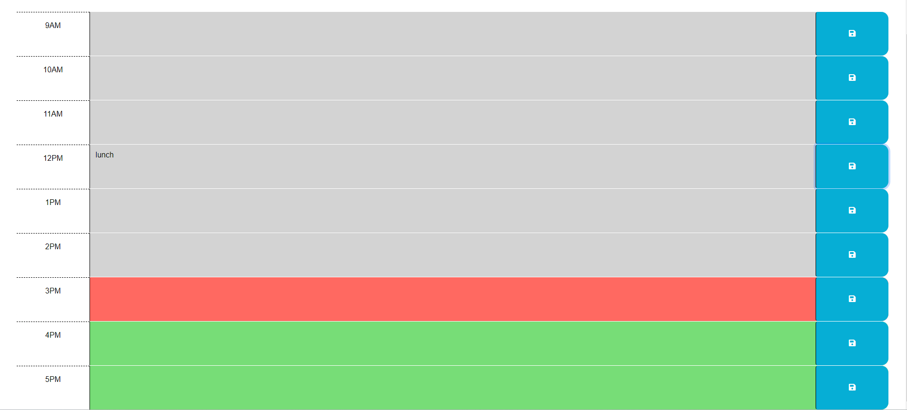

# Trevors-Work-Day-Scheduler
Modify the starter code to create a functional work day scheduler.

## Project Description
In the header of the page it will display the current date in dddd, MMMM D format.  Below the header is a calendar of times, each seperated 
by one hour.  The times that are displayed are from 9AM to 5PM.  The calendar rows are split into 3 sections: the time, a text field, and a 
save button.  A user is able to input events, or any text they want into the text field.  When the save button is pressed it will save that 
text field's text to local storage.  That way when the user returns to the page they will be able to see what they previously inputed.  
Desktop:   
Header:  

Calendar:  

## How to Get to the Page
The link to the repo for this project is located at: https://github.com/blanchardt/Trevors-Work-Day-Scheduler  
You can use this link to get to the live site: https://blanchardt.github.io/Trevors-Work-Day-Scheduler/  

## Credits
Modified by: Trevor Blanchard  
Original file location: https://github.com/coding-boot-camp/crispy-octo-meme  